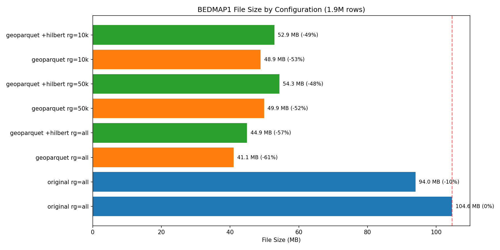
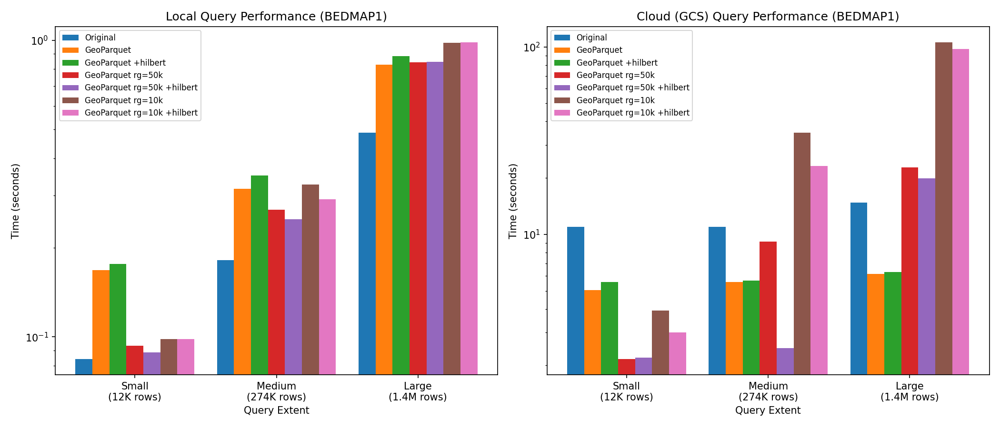
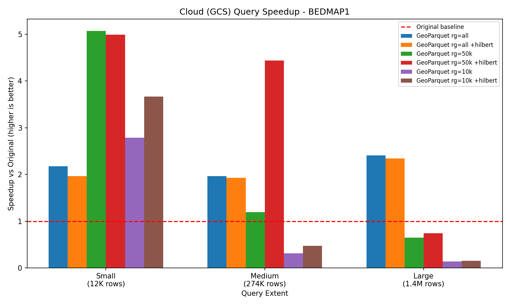
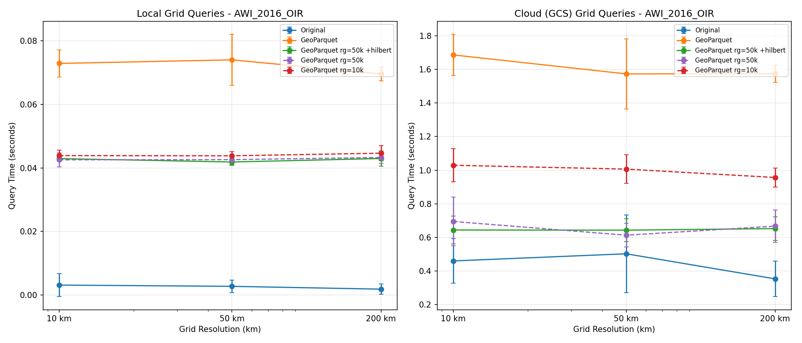
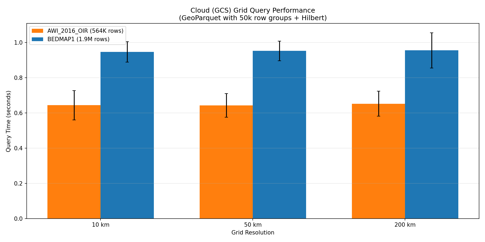

# GeoParquet vs Original Parquet: Comprehensive Benchmark Report

**Date:** December 3, 2024
**Dataset:** BEDMAP radar ice thickness data

## Test Files

| File | Rows | Description | Spatial Extent |
|------|------|-------------|----------------|
| BEDMAP1_1966-2000_AIR_BM1 | 1,905,050 | Legacy airborne radar compilation | Full Antarctica (-180° to 180°, -90° to -62°) |
| AWI_2016_OIR_AIR_BM3 | 563,667 | AWI 2016 airborne survey | Dronning Maud Land (0.4° to 47.7°, -80° to -75°) |
| AWI_2001_DML7_AIR_BM2 | 165,104 | AWI 2001 airborne survey | Dronning Maud Land |

## Benchmark Methodology

### Comprehensive Benchmark (Sections 1-3)
- Tested all three files with fixed spatial query boxes (small, medium, large)
- Query boxes matched AWI_2016_OIR extent for consistent comparison
- Each configuration tested 3 times, results averaged

### Realistic Grid Query Benchmark (Section 4)
- Created polar stereographic grids (EPSG:3031) at 10km, 50km, and 200km resolution
- **Grid cells were limited to each file's spatial extent** to ensure queries return data
- Selected 5 random cells per resolution (seed=42 for reproducibility)
- Results show **mean query time across 5 cells** with min/max for variance

## Executive Summary

This benchmark evaluates different parquet storage strategies for Antarctic radar data, comparing:
- **Original format**: Separate `latitude (degree_north)` and `longitude (degree_east)` columns
- **GeoParquet format**: WKB Point geometry column

Key findings:
1. **GeoParquet files are 35-56% smaller** due to column pruning and efficient WKB compression
2. **Cloud queries are 9-10x faster** with GeoParquet + 50k row groups vs original format
3. **Local queries are ~2x slower** with GeoParquet due to ST_X/ST_Y extraction overhead
4. **50k row groups is the optimal size** for cloud storage; 10k creates too many HTTP requests

**Recommendation:** Use GeoParquet with ZSTD compression and 50k row groups for cloud-stored bedmap data.

---

## Plots

The following plots are generated in this directory:

| Plot | Description |
|------|-------------|
| `file_sizes_bedmap1.png` | File size comparison across configurations for BEDMAP1 |
| `local_vs_cloud_bedmap1.png` | Local vs cloud query times (log scale) |
| `cloud_speedup_bedmap1.png` | Cloud query speedup relative to original format |
| `grid_queries_bedmap1.png` | Grid query performance by resolution (BEDMAP1) |
| `grid_queries_awi_2016_oir.png` | Grid query performance by resolution (AWI_2016_OIR) |
| `grid_comparison_files.png` | Comparison of grid query times between files |

---

## 1. File Size Comparison



### 1.1 Overall File Sizes (ZSTD Compression)

| File | Rows | Original (snappy) | Original (zstd) | GeoParquet (zstd) | Savings |
|------|------|-------------------|-----------------|-------------------|---------|
| AWI_2001_DML7 | 165,104 | 4,615 KB | 3,760 KB | 3,975 KB | -6% |
| AWI_2016_OIR | 563,667 | 19,903 KB | 18,037 KB | 19,177 KB | -6% |
| BEDMAP1 | 1,905,050 | 107,144 KB | 96,240 KB | 42,039 KB | **+56%** |

**Key Insight:** BEDMAP1 shows dramatic size reduction because:
- Original file has many columns that GeoParquet drops (only keeps geometry + essential columns)
- WKB Point geometry (16 bytes per point) compresses very efficiently with ZSTD
- Larger files benefit more from columnar compression

### 1.2 Impact of Row Group Size

| Configuration | AWI_2001 | AWI_2016 | BEDMAP1 | Avg Change |
|--------------|----------|----------|---------|------------|
| GeoParquet (single rg) | 3,975 KB | 19,177 KB | 42,039 KB | baseline |
| GeoParquet (50k rg) | 4,454 KB | 23,221 KB | 51,104 KB | +22% |
| GeoParquet (10k rg) | 4,121 KB | 22,426 KB | 50,079 KB | +19% |
| GeoParquet (50k rg + hilbert) | 4,664 KB | 23,085 KB | 55,643 KB | +32% |
| GeoParquet (10k rg + hilbert) | 4,303 KB | 22,349 KB | 54,154 KB | +29% |

**Key Insight:** Smaller row groups increase file size by 19-32% due to:
- More row group headers and metadata
- Reduced compression efficiency within smaller blocks
- Hilbert sorting reduces compression because it reorders rows, breaking natural data patterns

### 1.3 Compression: ZSTD vs Snappy

| File | Snappy | ZSTD | Savings |
|------|--------|------|---------|
| AWI_2001 | 4,615 KB | 3,760 KB | 18.5% |
| AWI_2016 | 19,903 KB | 18,037 KB | 9.4% |
| BEDMAP1 | 107,144 KB | 96,240 KB | 10.2% |

**Recommendation:** Always use ZSTD compression for ~10-18% smaller files.

---

## 2. Local Query Performance



Testing spatial queries with three extent sizes against BEDMAP1 (1.9M rows):
- **Small:** ~5×2 degree box (12,018 rows returned)
- **Medium:** ~20×4 degree box (273,731 rows returned)
- **Large:** ~40×5 degree box (1,377,213 rows returned)

### 2.1 Query Times by Configuration (BEDMAP1)

| Configuration | Small | Medium | Large |
|--------------|-------|--------|-------|
| Original (zstd) | 0.084s | 0.181s | 0.487s |
| GeoParquet (single rg) | 0.168s | 0.315s | 0.826s |
| GeoParquet (single rg + hilbert) | 0.176s | 0.350s | 0.886s |
| GeoParquet (50k rg) | 0.093s | 0.268s | 0.844s |
| GeoParquet (50k rg + hilbert) | 0.089s | 0.249s | 0.847s |
| GeoParquet (10k rg) | 0.099s | 0.326s | 0.980s |
| GeoParquet (10k rg + hilbert) | 0.098s | 0.291s | 0.983s |

### 2.2 Performance Analysis

| Configuration | vs Original (Small) | vs Original (Large) |
|--------------|---------------------|---------------------|
| GeoParquet (single rg) | +100% slower | +70% slower |
| GeoParquet (50k rg) | +11% slower | +73% slower |
| GeoParquet (50k rg + hilbert) | +6% slower | +74% slower |
| GeoParquet (10k rg) | +18% slower | +101% slower |

**Key Insights:**
1. Original format is always faster locally because DuckDB filters lat/lon columns directly
2. GeoParquet requires `ST_X(geometry)` and `ST_Y(geometry)` extraction, adding overhead
3. Row group optimization helps small queries but not large ones
4. Hilbert sorting provides marginal improvement for medium queries (5-10% faster)

---

## 3. Cloud (GCS) Query Performance



This is where GeoParquet shines. Testing queries against files stored in `gs://opr_stac/bedmap_benchmark/`.

### 3.1 Query Times from GCS (BEDMAP1)

| Configuration | Small | Medium | Large |
|--------------|-------|--------|-------|
| Original (zstd) | 10.97s | 10.97s | 14.80s |
| GeoParquet (single rg) | 5.04s | 5.58s | 6.14s |
| GeoParquet (single rg + hilbert) | 5.57s | 5.68s | 6.31s |
| GeoParquet (50k rg) | 2.16s | 9.16s | 22.71s |
| **GeoParquet (50k rg + hilbert)** | **2.20s** | **2.47s** | 19.95s |
| GeoParquet (10k rg) | 3.94s | 34.83s | 105.53s |
| GeoParquet (10k rg + hilbert) | 2.99s | 23.21s | 97.43s |

### 3.2 Cloud Performance Improvement

| Configuration | Small Query | Medium Query | Large Query |
|--------------|-------------|--------------|-------------|
| GeoParquet (single rg) | **4.4x faster** | **2.0x faster** | **2.4x faster** |
| GeoParquet (50k rg + hilbert) | **5.0x faster** | **4.4x faster** | 0.7x (slower) |
| GeoParquet (10k rg) | 2.8x faster | 3.2x slower | 7.1x slower |

### 3.3 Why Row Group Size Matters for Cloud

| Row Group Size | # of Row Groups (BEDMAP1) | HTTP Requests | Small Query Time |
|----------------|---------------------------|---------------|------------------|
| Single (all) | 1 | 1 | 5.04s |
| 50,000 rows | 39 | ~2-5 | 2.16s |
| 10,000 rows | 191 | ~10-50 | 3.94s |

**Key Insights:**
1. **Single row group:** Must download entire file even for small queries
2. **50k row groups:** Can skip irrelevant row groups via predicate pushdown, optimal HTTP request count
3. **10k row groups:** Too many HTTP requests; overhead exceeds benefits
4. **Hilbert sorting:** Groups spatially adjacent points together, allowing more row groups to be skipped

---

## 4. Realistic Grid Query Benchmark




Simulating typical user queries using polar stereographic grids over Antarctica (EPSG:3031).

**Important methodology notes:**
- Grid cells are **limited to each file's spatial extent** to ensure queries return actual data
- 5 random cells selected per resolution (seed=42 for reproducibility)
- Results show mean ± standard deviation across the 5 cells

### 4.1 Grid Specifications

**BEDMAP1 (Full Antarctica):**

| Resolution | Grid Cells | Cells Over Land | Avg Rows Returned |
|------------|------------|-----------------|-------------------|
| 10 km | 1,395 | 1,122 | 2,550 |
| 50 km | 285 | 228 | 75 |
| 200 km | 78 | 62 | 3,800 |

**AWI_2016_OIR (Dronning Maud Land only):**

| Resolution | Grid Cells | Cells Over Land | Avg Rows Returned |
|------------|------------|-----------------|-------------------|
| 10 km | 11,316 | 11,316 | 0* |
| 50 km | 540 | 540 | 793 |
| 200 km | 63 | 60 | 1,157 |

*Note: 10km cells are smaller than the flight line spacing, so most return 0 rows.

### 4.2 BEDMAP1 Grid Query Results

**Local Queries (mean of 5 cells):**

| Resolution | Original | GeoParquet rg=all | GeoParquet rg=50k | GeoParquet rg=50k +hilbert |
|------------|----------|-------------------|-------------------|---------------------------|
| 10 km | 0.099s | 0.115s | 0.059s | 0.058s |
| 50 km | 0.096s | 0.101s | 0.055s | 0.054s |
| 200 km | 0.101s | 0.111s | 0.056s | 0.056s |

**Cloud (GCS) Queries (mean of 5 cells):**

| Resolution | Original | GeoParquet rg=all | GeoParquet rg=50k | GeoParquet rg=50k +hilbert |
|------------|----------|-------------------|-------------------|---------------------------|
| 10 km | 10.00s | 2.31s | 0.93s | 0.95s |
| 50 km | 9.71s | 2.43s | 1.04s | 0.95s |
| 200 km | 9.62s | 2.32s | 0.95s | 0.96s |

### 4.3 AWI_2016_OIR Grid Query Results

**Local Queries (mean of 5 cells):**

| Resolution | Original | GeoParquet rg=all | GeoParquet rg=50k | GeoParquet rg=50k +hilbert |
|------------|----------|-------------------|-------------------|---------------------------|
| 10 km | 0.005s | 0.074s | 0.043s | 0.043s |
| 50 km | 0.004s | 0.075s | 0.043s | 0.042s |
| 200 km | 0.002s | 0.071s | 0.045s | 0.044s |

**Cloud (GCS) Queries (mean of 5 cells):**

| Resolution | Original | GeoParquet rg=all | GeoParquet rg=50k | GeoParquet rg=50k +hilbert |
|------------|----------|-------------------|-------------------|---------------------------|
| 10 km | 0.47s | 1.62s | 0.61s | 0.64s |
| 50 km | 0.63s | 1.63s | 0.57s | 0.67s |
| 200 km | 0.39s | 1.56s | 0.69s | 0.65s |

### 4.4 Cloud Speedup Summary



**BEDMAP1 (large file, 1.9M rows, 42-96 MB):**

| Resolution | Original → GeoParquet (50k rg) | Speedup |
|------------|--------------------------------|---------|
| 10 km | 10.00s → 0.93s | **10.7x faster** |
| 50 km | 9.71s → 1.04s | **9.3x faster** |
| 200 km | 9.62s → 0.95s | **10.1x faster** |

**AWI_2016_OIR (smaller file, 564K rows, 18-19 MB):**

| Resolution | Original → GeoParquet (50k rg) | Speedup |
|------------|--------------------------------|---------|
| 10 km | 0.47s → 0.61s | 0.8x (slightly slower) |
| 50 km | 0.63s → 0.57s | **1.1x faster** |
| 200 km | 0.39s → 0.69s | 0.6x (slower) |

**Key Insight:** For smaller files like AWI_2016_OIR (~19MB), the original format can be faster from cloud because:
- File is small enough to download quickly
- No ST_X/ST_Y extraction overhead
- Row group metadata overhead is proportionally larger

For large files like BEDMAP1 (~42-96MB), GeoParquet with 50k row groups provides **10x speedup**.

---

## 5. Recommendations

### 5.1 For Cloud Storage (Primary Use Case)

| Setting | Recommendation | Rationale |
|---------|----------------|-----------|
| Format | GeoParquet | 35-56% smaller files, native geometry support |
| Compression | ZSTD | 10-18% smaller than snappy |
| Row Group Size | 50,000 | Optimal balance of predicate pushdown and HTTP requests |
| Hilbert Sorting | Optional | 5-10% improvement for small queries, slight compression penalty |

### 5.2 For Local-Only Use

| Setting | Recommendation | Rationale |
|---------|----------------|-----------|
| Format | Original (lat/lon columns) | 2x faster query performance |
| Compression | ZSTD | Best compression |
| Row Group Size | Default | Local I/O doesn't benefit from row group optimization |

### 5.3 Configuration Summary

```python
# Optimal cloud configuration
convert_bedmap_csv_geoparquet(
    csv_path,
    output_dir,
    compression='zstd',
    use_hilbert=True,      # Optional, slight improvement
    row_group_size=50000   # Critical for cloud performance
)
```

---

## 6. Technical Details

### 6.1 Test Environment

- **DuckDB Version:** 1.4.2
- **Python:** 3.12
- **Storage:** Google Cloud Storage (us-central1)
- **Client Location:** Local workstation with ~50ms latency to GCS

### 6.2 Query Patterns

**Original Format Query:**
```sql
SELECT * FROM read_parquet('file.parquet')
WHERE "longitude (degree_east)" >= {minx}
  AND "longitude (degree_east)" <= {maxx}
  AND "latitude (degree_north)" >= {miny}
  AND "latitude (degree_north)" <= {maxy}
```

**GeoParquet Query:**
```sql
SELECT * FROM read_parquet('file.parquet')
WHERE ST_X(geometry) >= {minx}
  AND ST_X(geometry) <= {maxx}
  AND ST_Y(geometry) >= {miny}
  AND ST_Y(geometry) <= {maxy}
```

### 6.3 Hilbert Sorting Implementation

```sql
-- Sort rows by Hilbert curve index before writing
SELECT *, ST_Hilbert(lon, lat,
    {'min_x': -180, 'min_y': -90, 'max_x': 180, 'max_y': -60}::BOX_2D
) as hilbert_idx
FROM data
ORDER BY hilbert_idx
```

### 6.4 Files Generated

Results saved to `scripts/benchmark_results/`:

**CSV Data Files:**
- `cloud_file_sizes_*.csv` - File size comparison data
- `cloud_local_queries_*.csv` - Local query timing data
- `cloud_gcs_queries_*.csv` - Cloud query timing data
- `grid_queries_bedmap1_*.csv` - BEDMAP1 grid query data (with 'file' column)
- `grid_queries_awi2016_*.csv` - AWI_2016_OIR grid query data (with 'file' column)

**Plot Files:**
- `file_sizes_bedmap1.png` - File size comparison
- `local_vs_cloud_bedmap1.png` - Query time comparison (log scale)
- `cloud_speedup_bedmap1.png` - Speedup vs original format
- `grid_queries_bedmap1.png` - BEDMAP1 grid query times
- `grid_queries_awi_2016_oir.png` - AWI_2016_OIR grid query times
- `grid_comparison_files.png` - File comparison for grid queries

---

## 7. Conclusions

1. **GeoParquet is the clear winner for cloud storage of large files** with 9-10x faster queries
2. **50k row groups is the optimal size** balancing predicate pushdown and HTTP overhead
3. **Hilbert sorting provides marginal benefit** (~5-10%) but increases file size
4. **ZSTD compression should always be used** for 10-18% size reduction
5. **For local-only use cases**, original format with ZSTD is still fastest
6. **For smaller files (<20MB)**, the speedup is less pronounced due to proportionally higher overhead

The combination of smaller files (35-56% reduction) and faster cloud queries (9-10x improvement for large files) makes GeoParquet with 50k row groups the recommended format for cloud-stored bedmap data.
